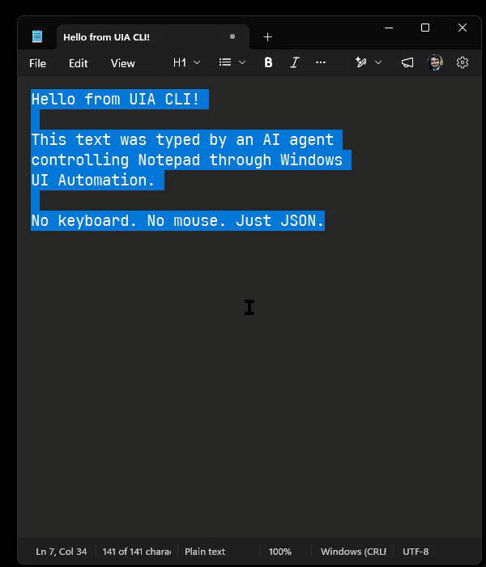
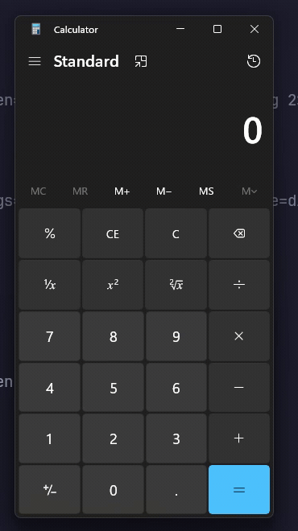

# 🖥️ UIA CLI

**[browser-use](https://github.com/browser-use/browser-use), but for Windows desktops.** The missing piece for computer-use agents.

AI agents can browse the web — but they can't click buttons in Notepad, fill forms in legacy enterprise apps, or automate anything without a browser. **UIA CLI fixes that.** It gives any AI agent full control of any Windows application through simple JSON commands.

<p align="center">
  
</p>

<p align="center">
  <em>"No keyboard. No mouse. Just JSON." — an AI agent types into Notepad via UIA CLI.</em>
</p>

<details>
<summary>🎬 See the visual overlay in action (Calculator demo)</summary>
<p align="center">
  
  <br><em>Ghost cursor, element highlights, and annotations — 25 × 25 = 625.</em>
</p>
</details>

<p align="center">
  
  
  
  
</p>

<p align="center">
  <a href="https://github.com/amitse/uiacli/actions/workflows/build.yml"></a>
  <a href="https://github.com/amitse/uiacli/releases/latest"></a>
  
  
</p>

## Quick Start

Install and try in 30 seconds — no .NET SDK or Go toolchain required:

```powershell
# Install
irm https://raw.githubusercontent.com/amitse/uiacli/master/install.ps1 | iex

# Try it
uia windows                              # See every open window
uia tree Calculator --depth 2            # Inspect Calculator's UI
uia click --window Calculator --name Five # Click the "5" button
uia batch actions.json --verbose          # Run a batch with visual overlay
```

Or [download the zip](https://github.com/amitse/uiacli/releases/latest) and extract anywhere.

## 🤖 Agent Skill — works with 50+ AI agents

Give your AI coding agent the ability to control Windows apps:

```bash
npx skills add amitse/uiacli
```

Works with Claude Code, GitHub Copilot, Cursor, Codex, Windsurf, Roo Code, and [50+ more agents](https://github.com/vercel-labs/skills#supported-agents). Once installed, just ask your agent to interact with any Windows app.

## Why UIA CLI vs Alternatives

|  | UIA CLI | pyautogui | AutoHotKey | Power Automate |
|---|:---:|:---:|:---:|:---:|
| JSON output for LLMs | ✅ | ❌ | ❌ | ❌ |
| Element tree (no coordinates needed) | ✅ | ❌ | ❌ | Partial |
| Agent skill (Claude/Cursor/Copilot) | ✅ | ❌ | ❌ | ❌ |
| Visual overlay (ghost cursor) | ✅ | ❌ | ❌ | ❌ |
| Action batching (1 HTTP call) | ✅ | ❌ | ❌ | ❌ |
| Structured errors with hints | ✅ | ❌ | ❌ | ❌ |
| Fallback to coordinates | ✅ | ✅ | ✅ | ❌ |
| Open source + MIT | ✅ | ✅ | Free | ❌ |

## Features

- **20+ commands** — windows, tree, click, type, key, batch, screenshot, clipboard, overlay, and more
- **Action batching** — 7 actions in one HTTP call, no per-command overhead
- **Visual overlay** — ghost cursor, highlights, and annotations so humans can follow what the agent does
- **Hybrid input** — UIA patterns first, `SendInput` fallback for apps with no accessibility
- **Structured JSON** — every response has `ok`, `error.code`, `error.message`, `error.hint`
- **Auto-start** — server launches on first CLI command, shuts down after 30min idle

## Action Batching

Send multiple actions in one call — the killer feature for agent speed:

```json
{
  "window": "Calculator",
  "actions": [
    {"type": "click", "element": {"name": "Two"}},
    {"type": "click", "element": {"name": "Five"}},
    {"type": "click", "element": {"name": "Multiply by"}},
    {"type": "click", "element": {"name": "Two"}},
    {"type": "click", "element": {"name": "Five"}},
    {"type": "click", "element": {"name": "Equals"}},
    {"type": "read", "element": {"automationId": "CalculatorResults"}}
  ],
  "verbose": true
}
```

With `--verbose`, the overlay shows a ghost cursor, highlights, and annotations for each action as it executes.

## Commands

| Command | Description |
|---------|-------------|
| `uia windows` | List all open windows |
| `uia tree <window>` | Inspect the UI automation tree |
| `uia find <window>` | Find elements by name, type, or automation ID |
| `uia click` | Click an element or coordinates |
| `uia type` | Type text into an element |
| `uia key` | Send key combinations (e.g., `ctrl+c`) |
| `uia batch <file>` | Execute a batch of actions from JSON |
| `uia screenshot` | Capture a window to PNG |
| `uia clipboard` | Get or set clipboard text |
| `uia launch <path>` | Launch an application |
| `uia focus <window>` | Bring a window to the foreground |
| `uia state` | Full desktop snapshot (windows, focus, cursor, screens) |
| `uia highlight` | Draw a highlight on the overlay |
| `uia annotate` | Show a text annotation on the overlay |

Run `uia <command> --help` for details.

## HTTP API

The server exposes a REST API on `http://localhost:9721` — use it from any language:

| Method | Endpoint | Description |
|--------|----------|-------------|
| GET | `/state` | Full desktop snapshot |
| GET | `/windows` | List windows |
| GET | `/windows/{handle}/tree` | Get element tree |
| POST | `/batch` | Execute action batch |
| POST | `/screenshot` | Capture screenshot |
| GET/POST | `/clipboard` | Get/set clipboard |
| POST | `/launch` | Launch an application |
| POST | `/overlay/highlight` | Add highlight |
| POST | `/overlay/cursor` | Move ghost cursor |

[Full API reference →](docs/adr/0001-client-server-with-auto-start.md)

## Architecture

```
┌─────────────┐         HTTP/JSON          ┌──────────────────┐
│   uia.exe   │    localhost:9721          │   UIA Server     │
│   (Go CLI)  │ ◄────────────────────────► │   (.NET 8)       │
└─────────────┘                            │  ┌────────────┐  │
                                           │  │ Uia.Core   │  │
     Any agent or script                   │  │ Uia.Overlay│  │
     can call uia.exe                      │  └────────────┘  │
     or hit the HTTP API                   └──────────────────┘
```

The Go CLI auto-starts the .NET server on first use. The server holds the UIA context, executes actions, and drives the visual overlay. [Why client-server? →](docs/adr/0001-client-server-with-auto-start.md)

## 📚 Hard-Won Patterns

Automating real Windows apps comes with quirks — `SetCursorPos` doesn't generate mouse events, UWP apps return temporary PIDs, some modern controls don't appear in the UIA tree. We documented **14 patterns** from working with Calculator, Paint, Notepad, and Edge:

- Why `SendInput` works but `SetCursorPos` doesn't for drawing
- The screenshot + tree correlation trick for custom-rendered UIs
- How to calibrate canvas coordinates when bounds don't line up
- Freehand drawing: 601-point Archimedean spiral in 1.77 seconds

**[Read LEARNINGS.md →](LEARNINGS.md)**

## 📰 News

- **[2026-05-17]** 🚀 v0.1.0 released — 20+ commands, action batching, visual overlay, HTTP API
- **[2026-05-17]** 🤖 Agent skill published — `npx skills add amitse/uiacli` for 50+ agents
- **[2026-05-17]** 📦 One-liner install — `irm .../install.ps1 | iex`, no SDK needed

## Build from Source

<details>
<summary>Prerequisites: Windows 10/11, .NET 8 SDK, Go 1.24+</summary>

```bash
# Build the .NET server
dotnet build UiaCli.sln

# Build the Go CLI
cd cli && go build -o ../uia.exe . && cd ..

# Run
uia windows
```

</details>

## Known Limitations

- **Windows only** — requires Windows UI Automation APIs
- **Single monitor DPI** — mixed-DPI multi-monitor setups may have coordinate offset issues
- **WinUI3/UWP apps** — some modern apps expose minimal UIA trees; coordinate fallback works
- **No UAC access** — can't automate elevated windows from a non-elevated process

## Contributing

Contributions welcome! Fork, build (`dotnet build && cd cli && go build`), test against a real app, and open a PR. Check [open issues](https://github.com/amitse/uiacli/issues) for ideas.

## License

[MIT](LICENSE)
